# marketi_app

## ⚫️ App Screens :

<table>
<tr>
  <td> </td>
  <td>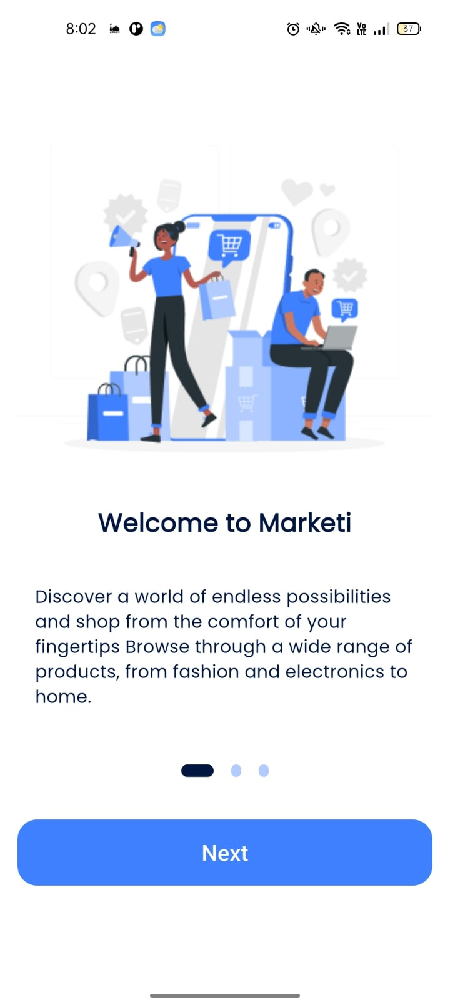</td>
  <td>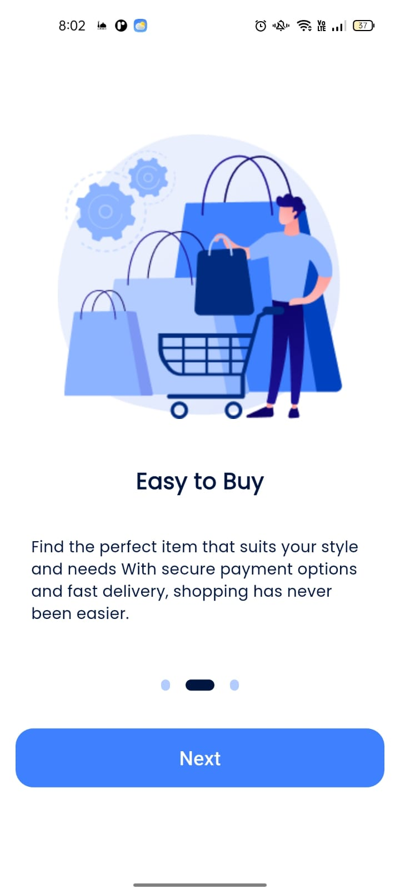</td>
  <td>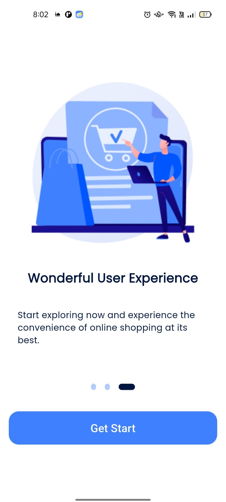</td>
</tr>
<tr>
  <td>Splash Screen</td>
  <td>Onboarding 1</td>
  <td>Onboarding 2</td>
  <td>Onboarding 3</td>
</tr>

<tr>
  <td>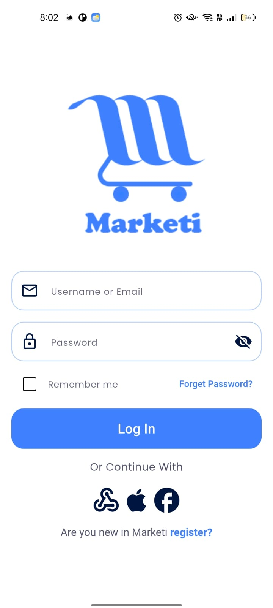</td>
  <td>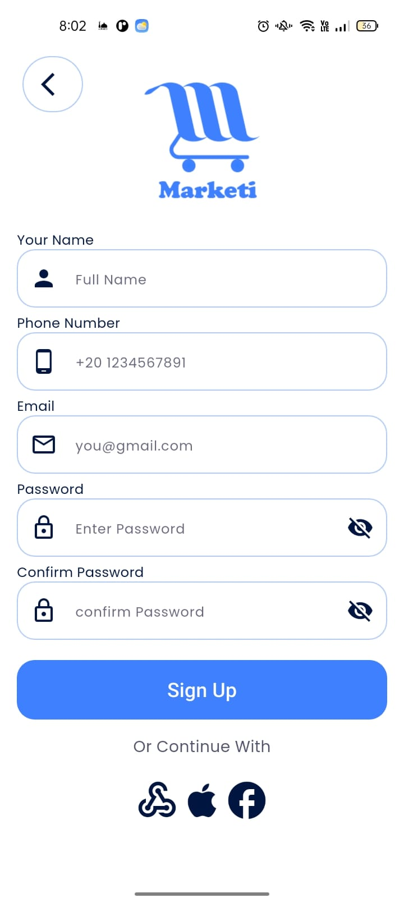</td>
  <td>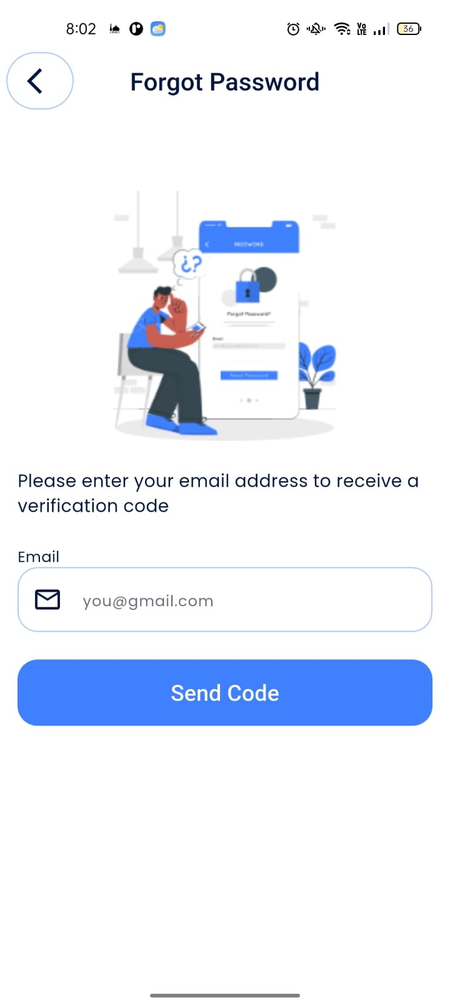</td>
  <td>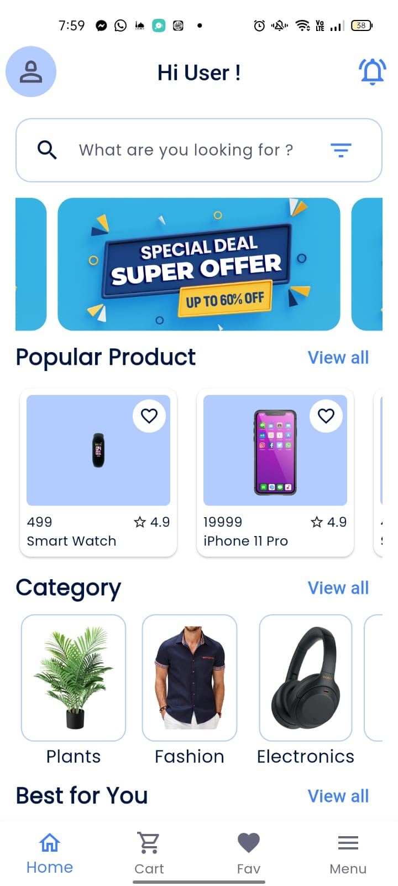</td>
  <td>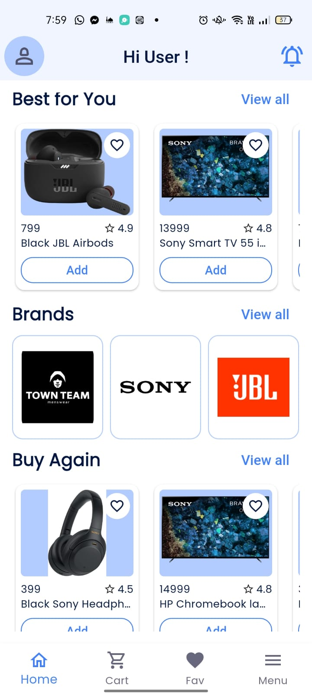</td>
</tr>
<tr>
  <td>Login Screen</td>
  <td>register Screen</td>
  <td>Forget Password Screen</td>
  <td>Home Screen</td>
  <td>Home Screen</td>
</tr>

<tr>
  <td>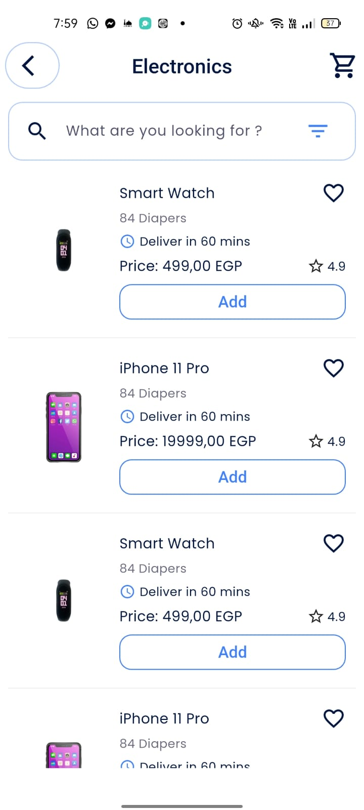</td>
  <td>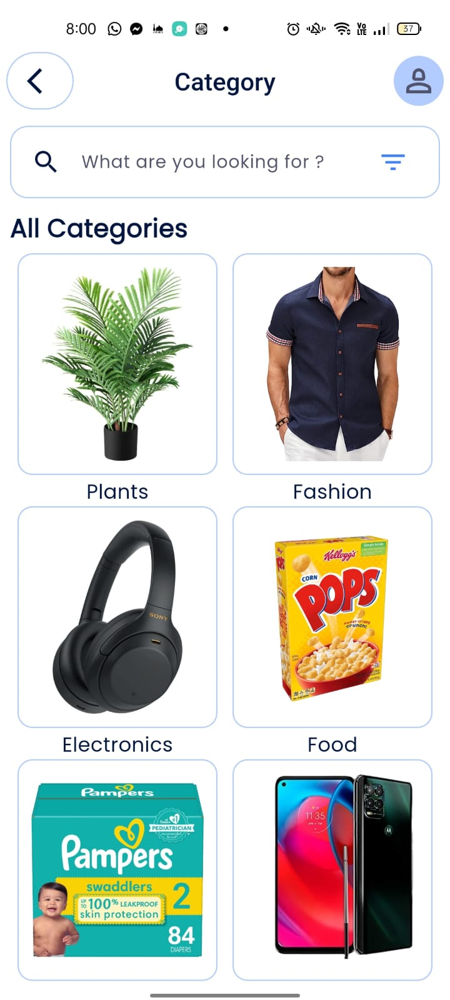</td>
  <td>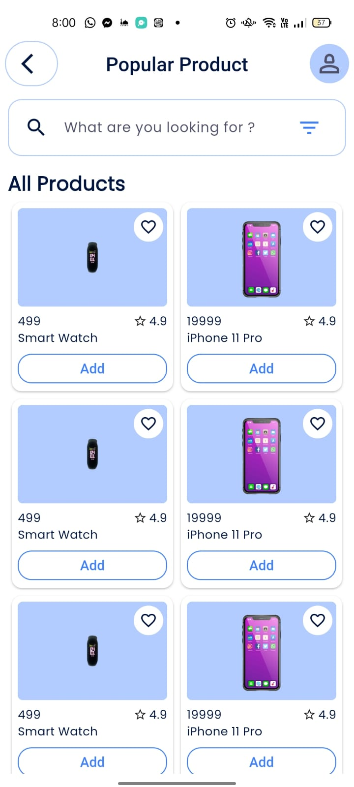</td>
  <td>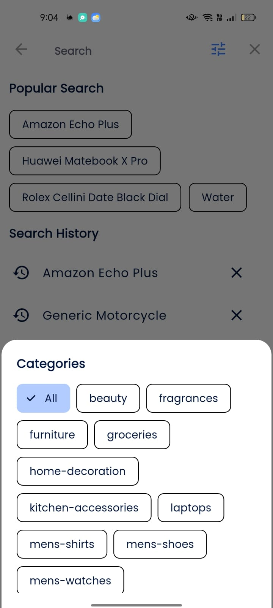</td>
</tr>
<tr>
  <td>Category Screen</td>
  <td>Categories Screen</td>
  <td>Products Screen</td>
  <td>Search Explore</td>
</tr>

</table>